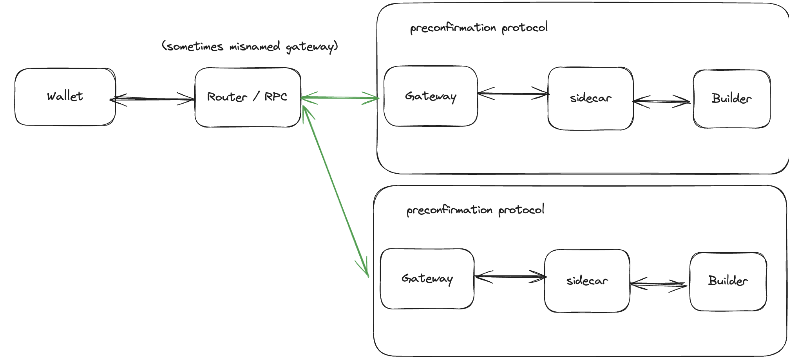

[](docs.interstate.so)
[]([https://t.me/+Pcs9bykxK3BiMzk5](https://t.me/+-i4dP7U2BggxMzAx))
[](https://x.com/interstatefdn)

## Preconfirmation Router
- To send a preconf request, navigate to the preconf-cli folder and run
  
         ```
         npm install
         npm link 
         interstate send_interstate_sidecar
         ```

This is an open source preconfirmation router, this sits between the preconf sender (which is usually a wallet, L2, or app) and the various preconfirmation networks, it allows the wallet to request an inclusion or execution preconfirmation without having to think of the implementation details of the various preconfirmation networks.

This repo is under active development & changing frequently.

This currently connects to the following preconfirmation networks (a-z):
 - Bolt by Chainbound
 - EthGas (in progress)
 - Interstate
 - Luban (in progress)
 - Primev

If you would like to be included, please add a pull request!




API Standards
- Spec formalized during sequencing week:
     - https://www.notion.so/V2-Aligning-Preconfirmation-APIs-13677b17f2e680e1abcffb6c598ce37b
     - [https://vaulted-mars-82e.notion.site/Based-Seq-API-Specification-5620443f82564259be19fc32c58e7023?pvs=4](https://vaulted-mars-82e.notion.site/Based-Seq-API-Specification-5620443f82564259be19fc32c58e7023)

- Pricing is not yet implemented, Ideally this router & all preconfirmation providers implement a uniform pricing spec, here's a suggestion we came up with during sequencing week: https://www.notion.so/Pricing-Spec-for-Preconfirmations-13777b17f2e68064adacc0e4ee8a5353

You can test using the cli here: https://github.com/interstate-labs/preconf-cli

