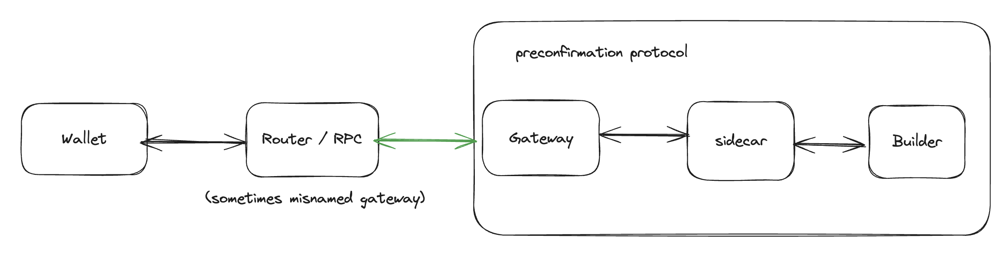

## Preconfirmation Router

This is an open source preconfirmation router, this sits between the wallet and the various preconfirmation networks, it allows the wallet to request an inclusion or execution preconfirmation without having to think of the implementation details of the various preconfirmation networks.

- Ideally this router & all preconfirmation providers implement this spec eventually: https://www.notion.so/Pricing-Spec-for-Preconfirmations-13777b17f2e68064adacc0e4ee8a5353

Full design doc: 
https://docs.google.com/presentation/d/1AWoVqdLo5QyqoVQWx5rV9sc8IXkuMMdeeDI6eYUb4B0/edit?usp=drive_web&ouid=103681167705499912489
https://docs.google.com/document/d/1SwpftRzDoukWV_VKVzFtNkBYAvXJDEvJqDLv2s7N0J8/edit?tab=t.0

